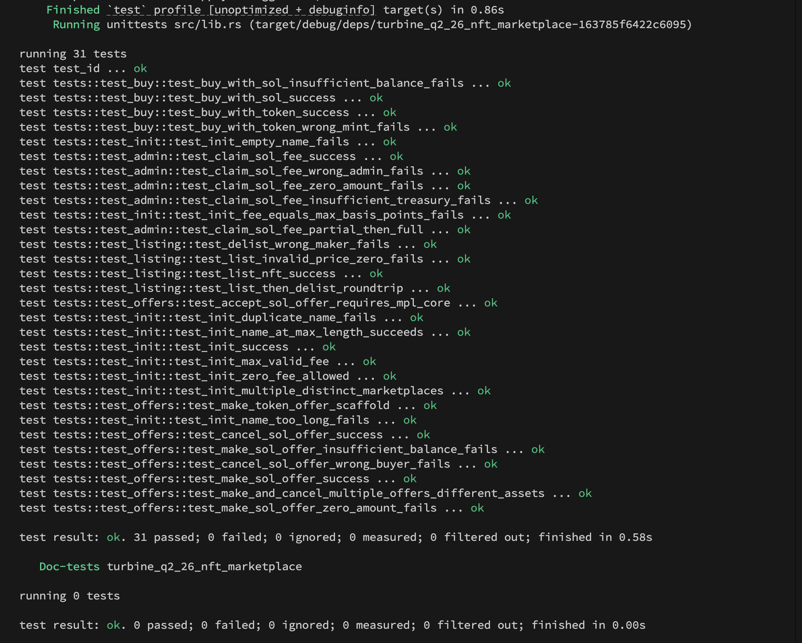

# Turbine Q2 '26 — NFT Marketplace

A production-grade NFT marketplace program built on [Solana](https://solana.com) using the [Anchor](https://www.anchor-lang.com/) framework and [Metaplex Core](https://developers.metaplex.com/core) (mpl-core) for asset ownership.  
Buyers can pay with native SOL **or** any SPL token, and a maker-offer system lets buyers name their price instead of paying the listed one.

---

## Features

| Category | What's implemented |
|---|---|
| **Marketplace lifecycle** | `init` — creates a named marketplace with configurable fee (basis points) and a reward-token mint |
| **Listing** | `list` — transfers mpl-core asset to the listing PDA; supports optional SPL payment mint |
| **Delisting** | `delist` — returns asset to maker, closes and reclaims listing rent |
| **SOL purchase** | `buy_with_sol` — splits price between maker and treasury; mints reward tokens to buyer |
| **Token purchase** | `buy_with_token` — same flow but via `transfer_checked`; treasury receives an ATA share |
| **SOL offers** | `make_sol_offer` / `accept_sol_offer` / `cancel_sol_offer` — SOL escrowed in a vault PDA |
| **Token offers** | `make_token_offer` / `accept_token_offer` / `cancel_token_offer` — tokens escrowed in an ATA owned by the offer PDA |
| **Fee management** | `claim_sol_fee` / `claim_token_fee` — admin withdraws accumulated treasury funds |

### Design highlights

- **Fee split via basis points** — fee is computed as `price × fee_bps / 10_000` in checked 128-bit arithmetic; the remainder always goes to the maker.
- **Reward tokens** — every buy or accepted offer mints marketplace-native tokens to the buyer, equal to the transaction value.
- **Token-2022 ready** — all token logic uses `Interface<TokenInterface>` / `transfer_checked`; works with both legacy SPL Token and Token-2022.
- **Generic payment mint** — `Listing.payment_mint: Option<Pubkey>` lets each listing be denominated in any token or SOL independently.
- **Offer escrow** — SOL offers lock funds into `[b"offer_vault", asset, buyer]`; token offers use an ATA whose authority is the offer PDA.

---

## Account structures

```
MarketPlace   — admin, fee (u16 bps), bump, treasury_bump, rewards_bump, name
Listing       — maker, asset, price (u64), bump, payment_mint (Option<Pubkey>)
Offer         — buyer, asset, amount (u64), bump, vault_bump (Option<u8>), payment_mint (Option<Pubkey>)
```

### PDA seeds

| Account | Seeds |
|---|---|
| Marketplace | `["marketplace", name]` |
| Treasury | `["treasury", marketplace]` |
| Rewards mint | `["rewards", marketplace]` |
| Listing | `["listing", asset]` |
| Offer | `["offer", asset, buyer]` |
| Offer vault (SOL) | `["offer_vault", asset, buyer]` |
| Offer vault (token) | ATA of offer PDA for payment\_mint |

---

## Repository layout

```
.
├── programs/
│   └── turbine-q2-26-nft-marketplace/
│       └── src/
│           ├── lib.rs
│           ├── state.rs          — MarketPlace, Listing, Offer
│           ├── constants.rs
│           ├── error.rs
│           ├── instructions/
│           │   ├── admin/        — init, claim_sol_fee, claim_token_fee
│           │   ├── listing/      — list, delist
│           │   ├── buy/          — buy_with_sol, buy_with_token
│           │   └── offer/        — make/accept/cancel × sol + token
│           └── tests/
│               ├── helpers.rs    — PDA derivation, SVM setup, instruction encoding
│               ├── test_init.rs
│               ├── test_admin.rs
│               ├── test_listing.rs
│               ├── test_buy.rs
│               └── test_offers.rs
├── scripts/
│   └── fetch-test-programs.sh   — downloads mpl-core binary for litesvm tests
└── assets/
    └── nft-marketplace-tests.png
```

---

## Prerequisites

| Tool | Version |
|---|---|
| Rust | 1.89.0 (see `rust-toolchain.toml`) |
| Solana CLI | 2.x |
| Anchor CLI | 0.31.1 |
| Node / Yarn | for Anchor scripts |

---

## Getting started

```bash
# 1. Install dependencies
yarn install

# 2. Build the program
anchor build

# 3. (Optional) Fetch the mpl-core binary for the full test suite
bash scripts/fetch-test-programs.sh
```

---

## Testing

Tests are written in Rust using [LiteSVM](https://github.com/LiteSVM/litesvm) — a fast in-process Solana VM that needs no local validator.

```bash
cargo test
```

### Test matrix

| Module | Tests | Requires |
|---|---|---|
| `test_init` | 9 | `anchor build` |
| `test_admin` | 5 | `anchor build` |
| `test_offers` | 9 | `anchor build` (SOL path); mpl-core (accept) |
| `test_listing` | 4 | mpl-core fixture |
| `test_buy` | 4 | mpl-core fixture |
| **Total** | **31** | |

Tests that need the mpl-core binary **skip gracefully** (print a message and return) rather than failing when the fixture is absent.  
Run `bash scripts/fetch-test-programs.sh` once to unlock them.

### All 31 tests passing



---

## Program ID

```
GdpmNmSGvz9AkftRpjdCXKeRroQie68vzUufvZTyCy8V  (localnet)
```

---

## Dependencies

```toml
anchor-lang  = "0.31.1"
anchor-spl   = "0.31.1"
mpl-core     = "0.11.1"

# dev
litesvm      = "0.6"
solana-sdk   = "2"
```

---

## Error codes

| Code | Name | Meaning |
|---|---|---|
| 6000 | `EmptyName` | Marketplace name is blank or whitespace-only |
| 6001 | `NameTooLong` | Name exceeds 30 characters |
| 6002 | `InvalidFee` | Fee ≥ 10 000 bps, or claim amount is zero |
| 6003 | `InvalidPrice` | Listing price or offer amount is zero |
| 6004 | `MathOverflow` | Checked arithmetic overflowed |
| 6005 | `InsufficientTreasuryFunds` | Treasury balance too low to cover the claim |
